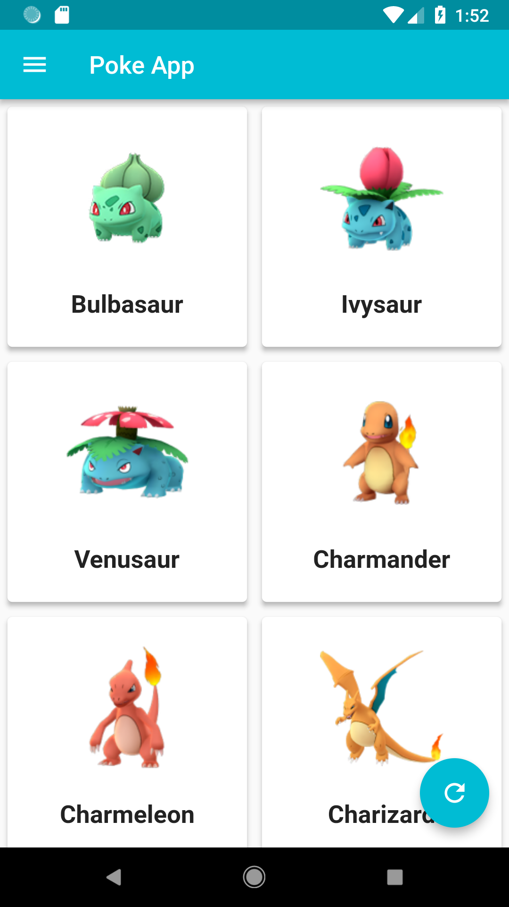
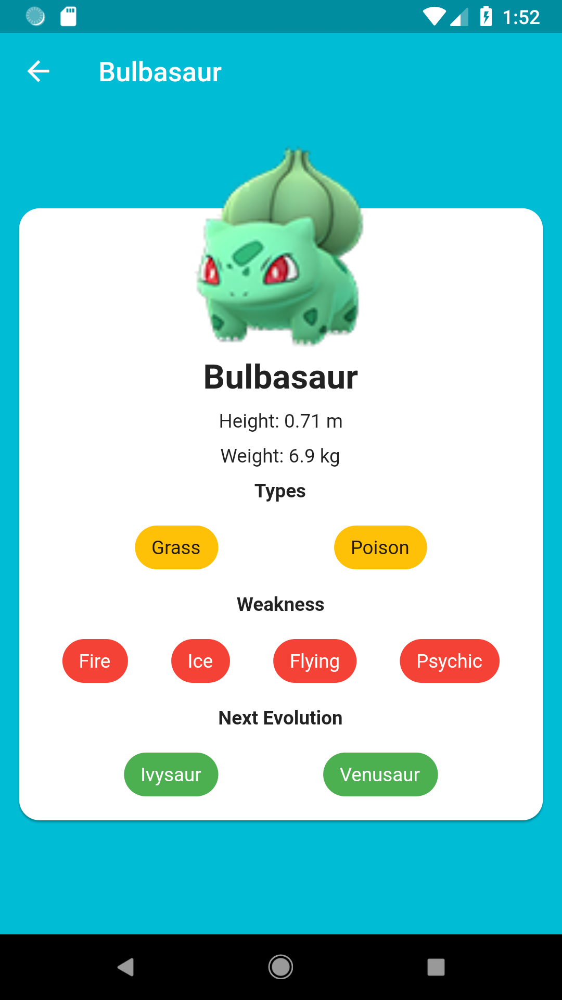

# Pokemon-App

A simple pokemon working like a pokedex for info about Pokemons 

## Getting Started

For help getting started with Flutter, view our online
[documentation](https://flutter.io/).

## Credits

- This app is learnt and made from a tutorial by [Pawan Kumar](https://github.com/iampawan).
- The api for pokemons can be found [here](https://raw.githubusercontent.com/Biuni/PokemonGO-Pokedex/master/pokedex.json). 
- A json to dart converter was also used from this [project](https://javiercbk.github.io/json_to_dart/).
